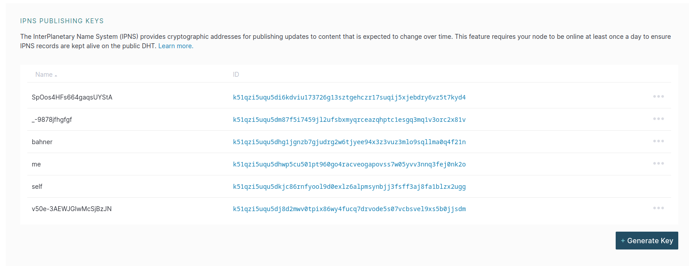

# 間 DID specs

This spec is a [DID spec](https://w3c.github.io/did-core/) specification for the 間.

The implemenation is only meant to be used for the 間 and not for general purpose DIDs.
But if outside services would like to accept or inspect them, they should be able to do so.

These DID's are only *a* way to communicate, but entities can use other ways to communicate as well.

## Method

The method name is 間 - but DID spec wants ASCII, so it must be "ma".

This is taken from [Alan Kay's 1997 OOPSLA keynote, "The computer revolution hasn't happened yet".][oopsla]

## Identifier

The IPNS identifier used for messaging and a fragment which is the name of the entity.

The fragment ought to be unique, but the IPNS identifier is guaranteed to be unique and functions as a namespace.

This allows for vanity names, but this is deprecated.

The IPNS identifier can be changed, but the fragment should not be changed.

This is not a requirement, but a practical consideration.

### IPNS

The identifier is the [IPNS identifier][ipns-record] of the entity's public key. This is because then we can use that to lookup the public key of the entity. This is required because IPNS keys are not suitable for encryption of the payload.

So we need a way to express the public key of the entity. This is done by publishing a DID Document to the IPNS key. The DID Document contains the public key of the entity.

The identifier then is the IPNS identifier and the fragment is the name the entity uses where it's at. This should match the name of IPFS key used to publish the DID Document.

### Fragment

The Fragment is the actual object identifier. In a MOO using 間 this would be the *object ID* and you should treat it as such. The IPNS name is just a vector to reach the Entity. So when you rekey your object, you may keep the secret keys associated with and others actors can verify that the fragment still matches the key the have and just use the new IPNS name for communication.

The fragment is not strictly a theoretical requirement for message passing, but it is a practical one. It is the name of the entity. The fragment shouldn't change.

The fragment is a [NanoID] and MUST match the following Regex:

```regex
^[a-zA-Z0-9_-]*$
```

Implementations *MUST* require a fragment for the identifier.

### DID Example

An example of a valid DID is: `did:ma:k51qzi5uqu5dhwp5cu501pt960go4racveogapovss7w05yvv3nnq3fej0nk2o#me`

In Brave Browser this looks like this:

## Rekeying

The DID will be accompanied by a DID Document. This document will contain the public key of the entity. The IPNS identifier is the IPNS identifier of the public key of the entity.

As such message senders can correlate the IPNS identifier with the public key of the entity and the name of the fragment. If only one of these changes, that would be valid rekeying.

It's up to implementers how they want to handle this.

[ipns-record]: <https://specs.ipfs.tech/ipns/ipns-record/> "IPNS Record Specification"
[oopsla]: <https://www.youtube.com/watch?v=oKg1hTOQXoY&t=2268s> "Alan Kay's 1997 OOPSLA keynote, 'The computer revolution hasn't happened yet'."
[NanoID]: <https://github.com/ai/nanoid> "A tiny (108 bytes), secure, URL-friendly, unique string ID generator for JavaScript."
